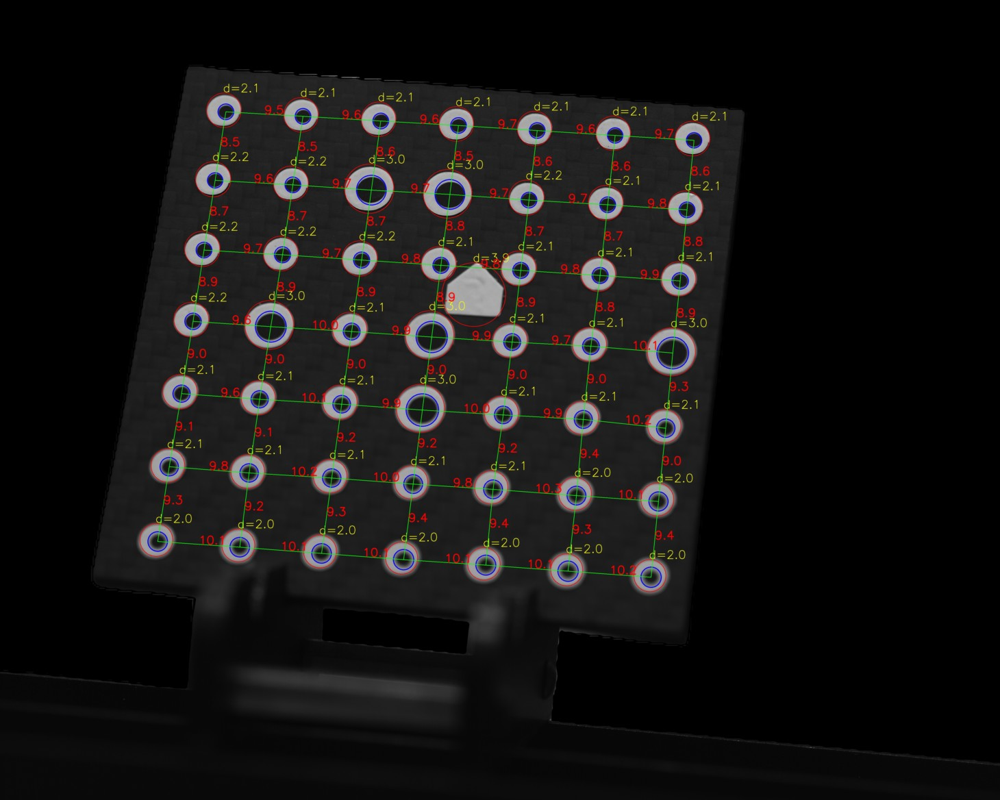
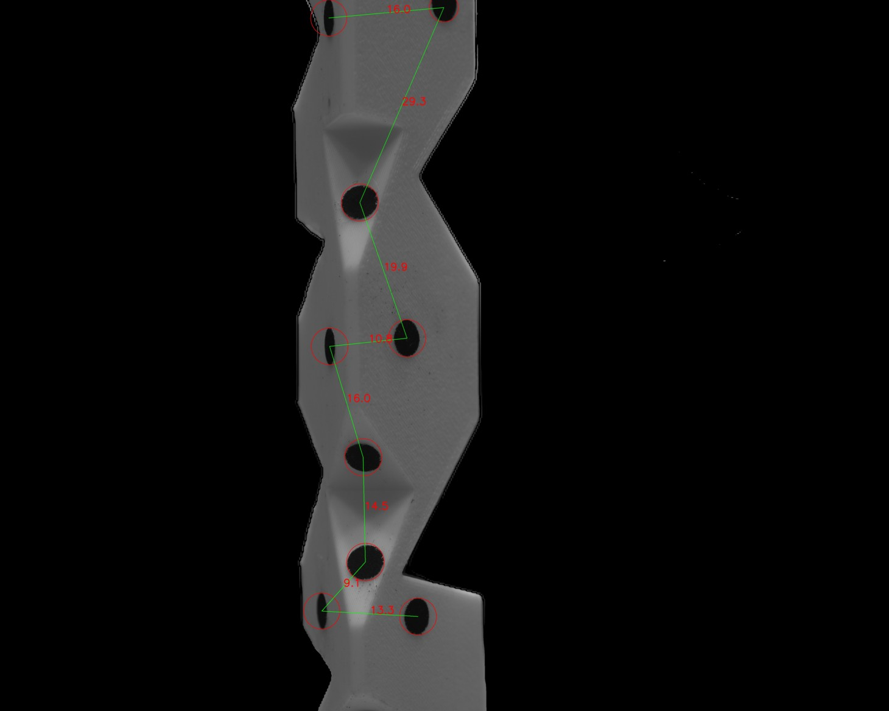
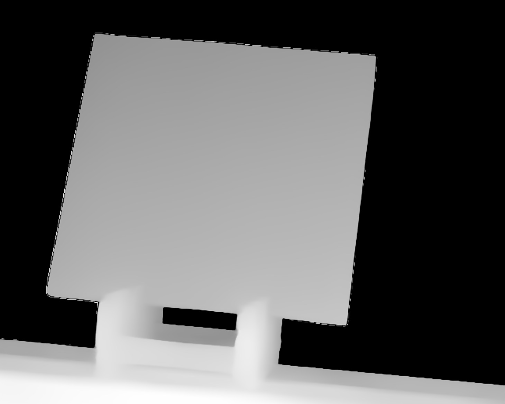
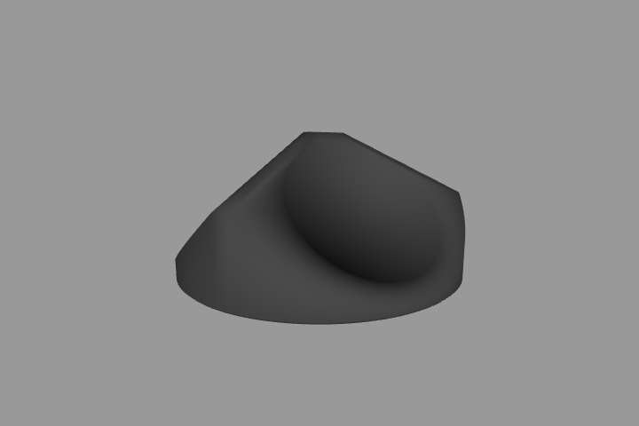
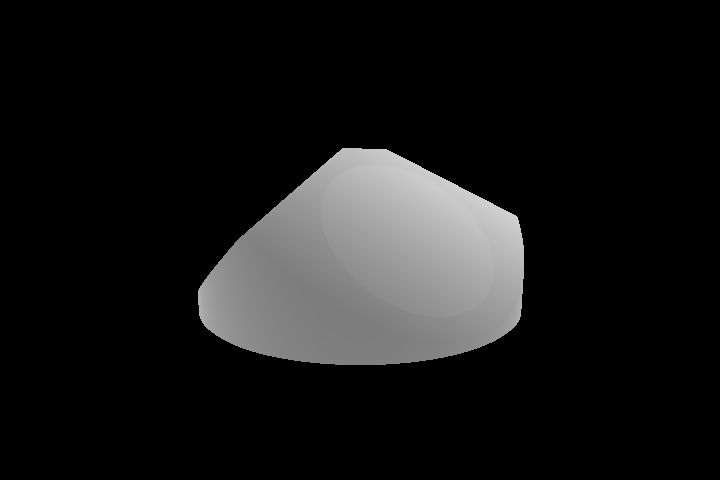
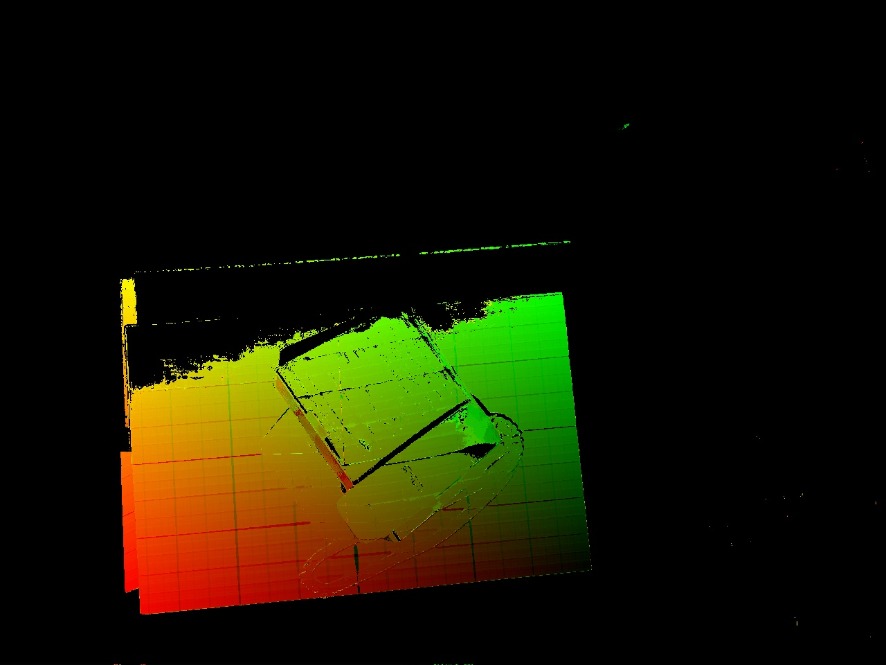
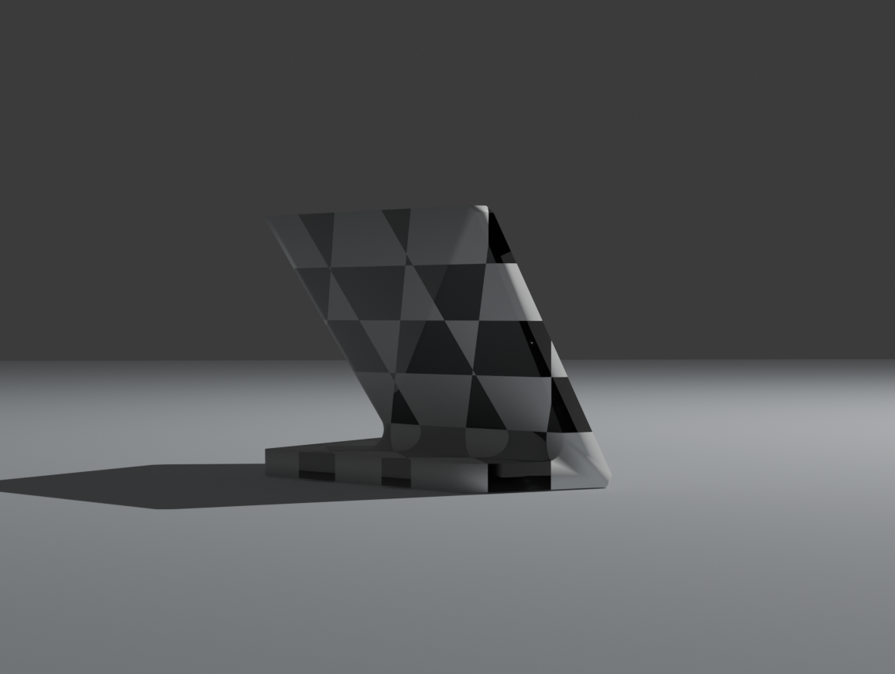
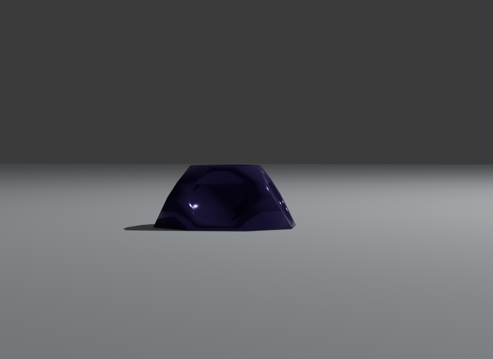
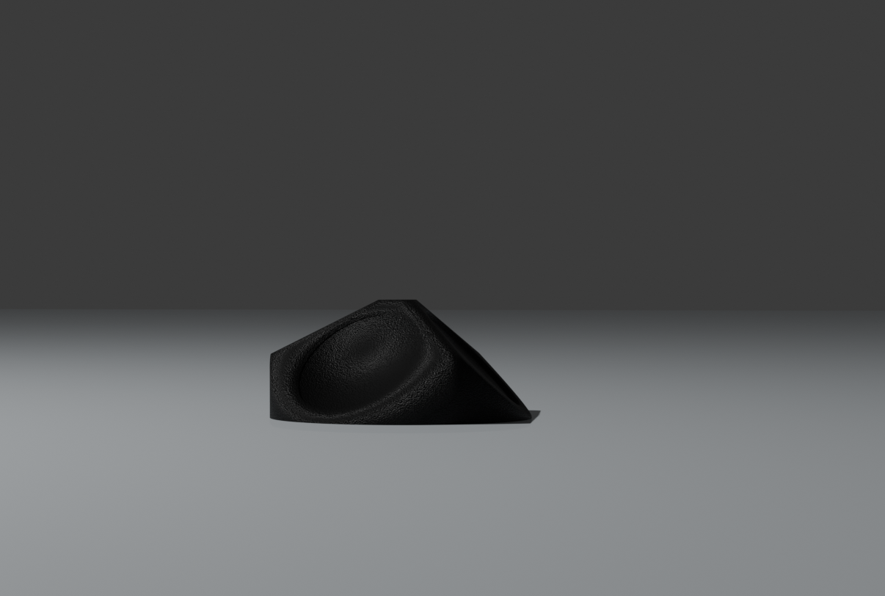

# northGeom3d

## Описание
`northGeom3d` - проект по измерению объектов в рамках хакатона ИТМО и Ai Talent Hub - AI Product Hack

## Возможности
- **Расстояние между точками, диаметр окружности:** Измерение расстояния между черными точками и измерение диаметра белых окружностей
- **Расстояние между точками:** Измерение расстояния между черными точками (маркерные башни)
- **Листовой прокат:** (TODO: Road map)

## Установка

1. Клонирование проекта:
    ```bash
    git clone https://github.com/ankkarp/northGeom3d.git
    cd northgeom3d
    ```

2. Установка зависимостей:
    ```bash
    pip install -r requirements.txt
    ```

## Использование

1. Запуск приложения:
    ```bash
    streamlit run app.py --server.port=<НОМЕР_ПОРТА>
    ```

2. Откройте приложение по адресу `http://localhost:<НОМЕР_ПОРТА>`.

3. Выберите вкладку с нужным режимом

4. Загрузите изображения

5. Нажмите кнопку "Обработать"







## Генерация датасета из stl-файла.

В директории make_dataset находится исполняемый файл generate_dataset.py. В этом файле необходимо указать путь к целевому stl-файлу и количество ракурсов. После исполнения скрипта, в директории появится еще три директории train, test и val, в которых будут отрендеренные изображения stl-файла с различных углов. В папке test также будут карты нормалей и карты глубин для каждого ракурса. Помимо этого создаются еще три файла ``` transforms_* ```, в который для каждого кадра приводятся параметры положения камеры.

 

## Структурный свет

В папке structured_light находится алгоритм по 3Д реконструкции объекта с помощью структурного света.



## Acknowledgements
- Оценка глубины модель HuggingFace: `depth-anything/Depth-Anything-V2-base-hf`
- Библиотеки: Streamlit, Pillow, OpenCV, NumPy, Transformers, Torch

## Генерация датасета
1. Настроить конфигуационный файл в диреткории "data/blender/"
2. Запустить в этой же директории с указанием выбранной фигуры комманду
```
    python render.py --figure=./figures/marker_60_fd.blend
```



